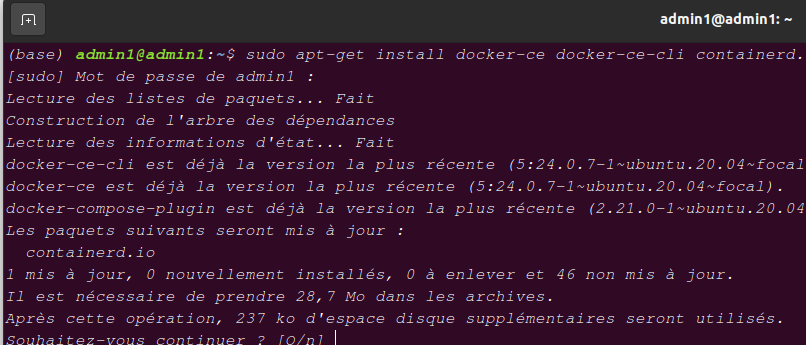
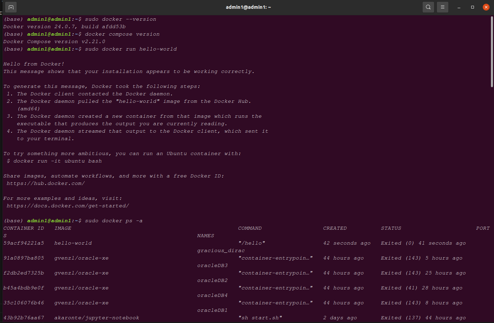
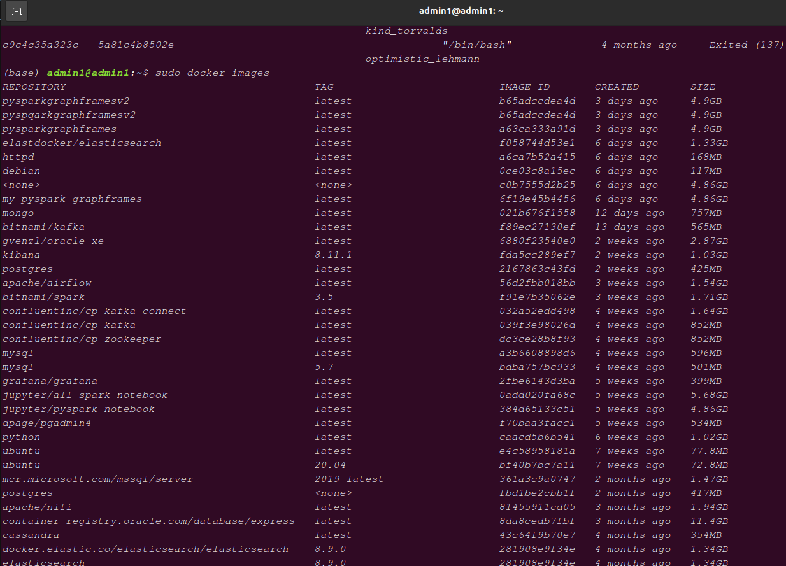

## THIS REPOSITORY DESCRIBE HOW TO CONNECT REMOTLY TO OUR LINUX SYSTEM FROM ANOTHER

### To show all detail on it, we will stimule all proccess  with to two linux system ; ubuntu and debian running on docker container

### Alternatively, you can also do it with two virtual sys if you have it

### The proccess is the same for real or virtual machine

#######################       Step 1       ##############################

# STEP 1:

## Install docker , pull ubuntu and debian images on our local machine

#### Install docker on linux:

    -   sudo apt-get install docker-ce docker-ce-cli containerd.io docker-compose-plugin

#### Once you install Docker and docker compose, you can issue various commands in the terminal window. Popular commands to test the Docker setup on Ubuntu include:

    -   sudo docker --version
    -   docker compose version
    -   sudo docker run hello-world
    -   sudo docker images
    -   sudo docker ps -a

### Show example in image:

#### In order to avoid to always use sudo, you can add actual user connected to docker users group

#### If docker users group doesn't exist, create it with with command:

    -   sudo groupadd docker

#### After that add actual user to docker group by exec this command:

    -   sudo usermod -aG docker <username>

#### Now restart docker service on your sys in order to apply the new change:

    -   On systems using systemd (e.g., Ubuntu 16.04 and newer): sudo systemctl restart docker
    -   On systems using service (older Ubuntu versions, CentOS, etc.): sudo service docker restart

#### Verify Docker Group Membership:

    -   groups <username>

## NB : you need a docker hub account to pull docker images from it on windows but not required on linux

### Pull Ubuntu and Debian Images

    -   docker pull ubuntu  #this will pull the latest version
    -   docker pull debian  #this will pull the latest version

